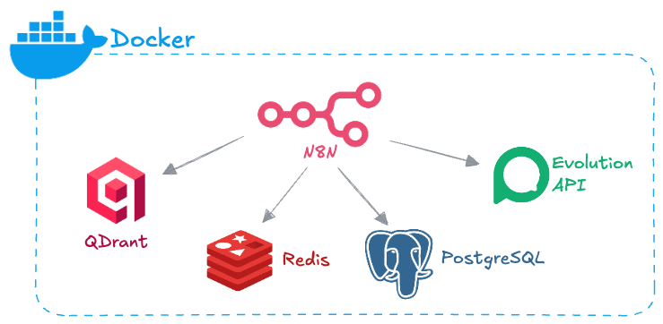

# n8n-infra

Infraestrutura automatizada para implantação do [n8n](https://n8n.io) utilizando Docker Compose.  
Este projeto define os serviços, volumes e redes necessários para executar o n8n em um ambiente isolado.



## 📦 Objetivo

Provisionar uma stack Docker para rodar o n8n com foco em:
- Reprodutibilidade local ou em servidores privados
- Organização dos volumes e persistência de dados
- Facilidade de manutenção e versionamento da infraestrutura

## ⚙️ Tecnologias

- Docker
- Docker Compose
- n8n (Automação de Workflows)
- PostgreSQL, Redis (Mémoria e Cache)

## 📁 Estrutura do Projeto

```
n8n-infra/
├── config/
│   └── .env.exemple
├── .gitignore
├── docker-compose.yml
├── LICENSE
└── README.md
```

## 🚀 Como iniciar

1. Clone este repositório:
   ```bash
   git clone git@github.com:dinos-it/n8n-infra.git
   cd n8n-infra
   ```

2. Crie um arquivo `.env` baseado no `.env.example`.

3. Para as chaves `N8N_ENCRYPTION_KEY`e `N8N_USER_MANAGEMENT_JWT_SECRET` execute o comando abaixo para cada uma delas e atribua o valor no arquivo `.env`.
   ```bash
   openssl rand -base64 32
   ```

4. Suba os containers:
   ```bash
   docker compose up -d
   ```

5. Acesse o n8n via:
   ```
   http://localhost:5678
   ```

---

© 2025 **Winkller IT**.
